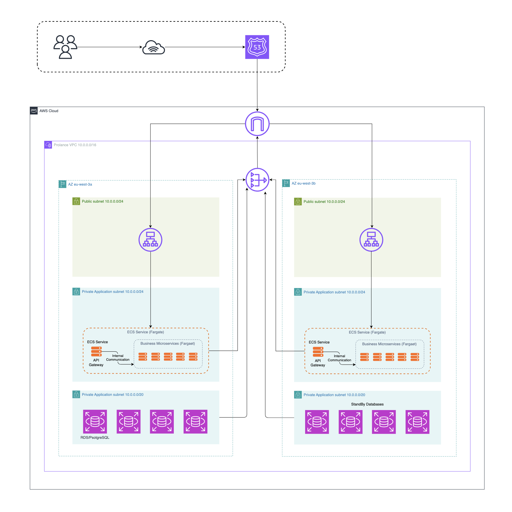
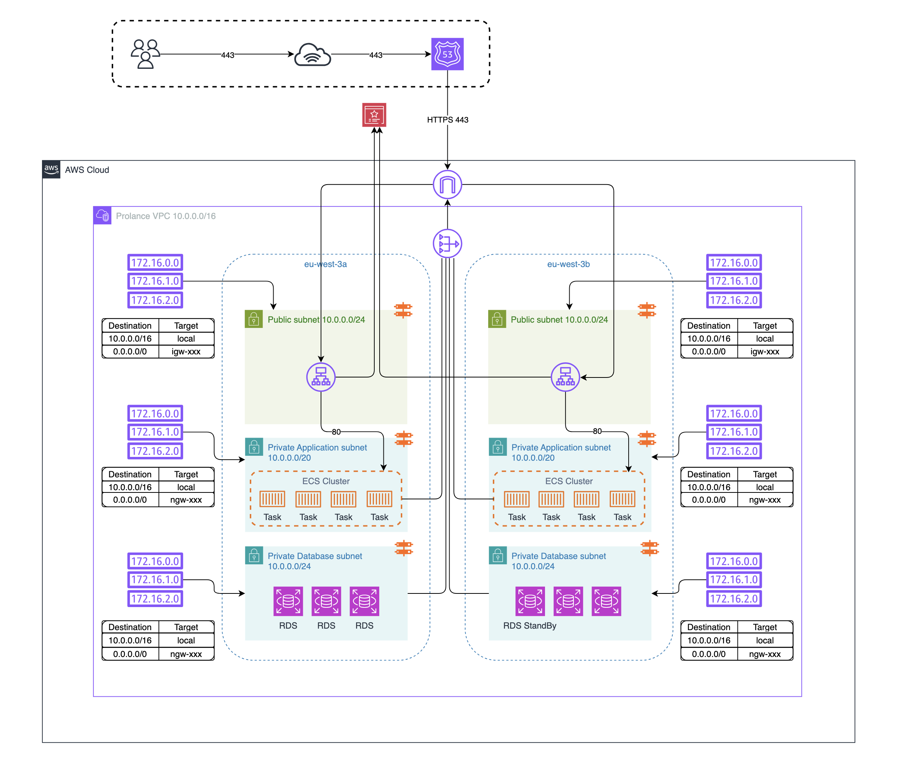
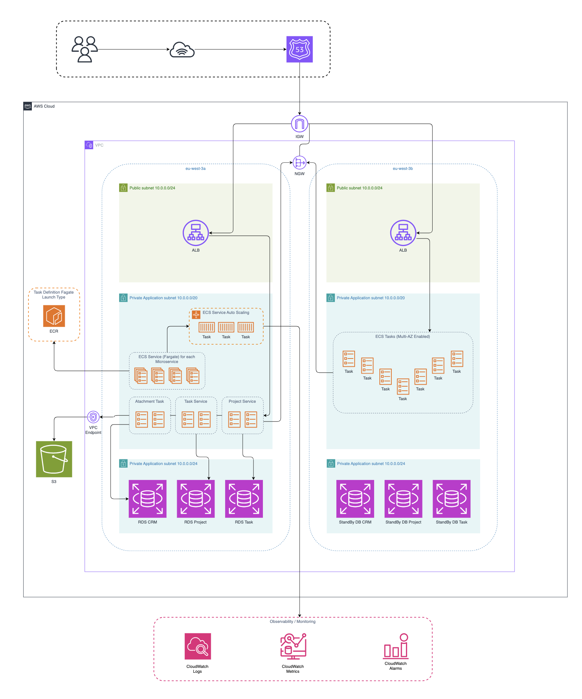

# Prolance AWS Infrastructure

This repository contains the Terraform infrastructure for the Prolance platform on AWS. The project is focused on building a secure, scalable, and resilient cloud foundation for a containerized application running on Amazon ECS.

The goal is to create an AWS environment that is ready for production use, with a clear separation between public access, application workloads, and private data services. The design uses a multi-AZ setup to improve availability and reduce single points of failure.

## What this project is doing

This project is setting up the core AWS building blocks for Prolance:

- A VPC with public and private subnets across multiple Availability Zones
- Application Load Balancing through an ALB in front of the application layer
- Route 53 for DNS and domain routing
- CloudFront as the CDN layer in front of the application experience
- Internet access for public-facing services through an Internet Gateway
- Private application workloads using NAT-based outbound traffic
- Private database subnets for data services
- Secure attachment storage in Amazon S3 via a VPC Endpoint to keep file traffic private inside the network
- Security groups and network ACLs to control traffic between layers
- Amazon ECR for storing container images
- ECS task definitions for container-based application deployments
- S3-based Terraform state bootstrapping for infrastructure consistency

This is a platform foundation for running Prolance in AWS, not just a single service deployment. It is designed to support future growth and more production-grade services.

---

## High-level AWS architecture



### Architecture overview

The application is expected to be exposed through a public-facing layer, while the actual runtime workloads remain in private subnets. This keeps the application more secure and allows the platform to isolate traffic between the internet-facing layer and private services.

- Route 53 manages DNS and domain entry for the platform
- CloudFront acts as the CDN layer to improve performance and cache static content
- ALB distributes traffic across the ECS application tasks in a resilient way
- ECS workloads run in private application subnets
- Databases and sensitive services stay in private database subnets
- Attachment files are stored in S3 and accessed through a VPC Endpoint so that private traffic stays inside the VPC
- Outbound traffic from private services flows through NAT
- Secrets and logs are handled outside the application layer for better control and traceability

---

## Networking architecture

The network design is based on a multi-AZ VPC with a clear tiered layout. The Terraform configuration currently defines the following addressing model:



### Networking model

- Public subnets are used for internet-facing components and shared access paths
- Route 53 handles DNS routing and domain traffic entry
- CloudFront sits in front of the application to accelerate content delivery and reduce load at the origin
- ALB distributes traffic across ECS tasks and provides health checks and failover support
- Private application subnets host the app containers and internal services
- Private database subnets isolate database resources from direct public access
- S3 attachments are accessed privately through a VPC Endpoint rather than direct public access
- NAT provides outbound internet access for private workloads without exposing them directly
- The environment is spread across multiple Availability Zones for better resilience

This is a multi-AZ deployment pattern, which means the application can continue running even if one AZ becomes unavailable.

---

## ECS architecture

The container layer is designed around Amazon ECS with Fargate. The task definitions in this repository are set up for awsvpc networking, which gives each container task its own ENI and better control over networking and security.



### ECS design notes

- ECS tasks run in private subnets
- Containers use Fargate for serverless compute
- Applications receive configuration and secrets from secure external sources
- Logs are pushed to CloudWatch for visibility and troubleshooting
- Image lifecycle rules in ECR help keep repositories clean and manageable

---

## AWS services included in this repo

### Core infrastructure
- VPC
- Subnets
- Route tables
- NAT Gateway
- Internet Gateway

### Security
- Security groups
- Network ACLs
- IAM roles for ECS execution and task access

### Compute and containers
- Amazon ECR
- ECS task definitions
- Fargate-based runtime model
- ALB for traffic distribution and health checks

### Edge and connectivity
- CloudFront as CDN layer
- Route 53 for domain routing and DNS
- VPC Endpoint for S3 private attachment access

### Operational foundation
- CloudWatch logging integration
- S3-based Terraform state storage
- Environment-level separation for deployment stages

---

## Project structure

```text
prolance-aws-infra/
├── README.md
├── terraform/
│   ├── bootstrap/
│   │   └── terraform-state/
│   ├── environments/
│   │   └── dev/
│   └── modules/
│       ├── ecr/
│       ├── ecs-service/
│       ├── iam/
│       ├── monitoring/
│       ├── nacl/
│       ├── route53/
│       ├── s3/
│       ├── secrets/
│       ├── security-groups/
│       └── vpc/
```

---

## Multi-AZ deployment strategy

This project is designed around a multi-AZ deployment model. The VPC is split across at least two Availability Zones so that the platform is not dependent on a single AZ.

This gives the project a more production-ready shape:

- Better availability during AZ failures
- Reduced blast radius for infrastructure issues
- Safer placement of application and database tiers
- More reliable foundation for future scaling and cluster expansion

---

## Deployment intent

The infrastructure in this repository is meant to support a real-world application environment for Prolance. It provides the foundation for:

- secure network isolation
- containerized workloads in ECS
- ALB-based application delivery and load balancing
- Route 53 DNS management and routing
- CloudFront CDN acceleration for edge delivery
- private database access
- attachment storage in S3 through a VPC Endpoint
- managed image storage in ECR
- structured environment-based deployments
- a scalable AWS hosting model for future services

---

## Notes

This repository focuses on the infrastructure layer. The application code itself is separate, but this Terraform project creates the AWS platform that the application will run on.

The design is modular and can be extended with additional components later, including:

- more ALB listeners and routing rules
- Route 53 DNS records and health checks
- CloudFront distribution optimization and caching rules
- more advanced monitoring and alerting
- Database configuration and backup setup
- S3 bucket lifecycle policies for attachments and storage hygiene
- Secrets management and service-to-service access policies